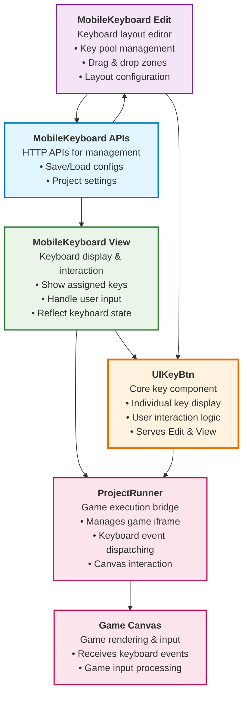

## MobileKeyboard APls

The HTTP APIs provided by spx-backend for mobileKeyboard management. provide to Edit and View

See details in [`MobileKeyboard APIs`](./module_MobileKeyboardAPIs.ts).

## MobileKeyboard Edit

Used for editing mobile keyboard layouts. It provides common key pools and fixed editing zones, allowing users to drag the corresponding keys to the desired areas.
See details in [`MobileKeyboard Edit`](./module_MobileKeyboardEdit.ts).

## MobileKeyboard View

Used for displaying the mobile keyboard layout. It shows the assigned keys in their respective zones and reflects the current keyboard state.
See details in [`MobileKeyboard View`](./module_MobileKeyboardView.ts).

## UIKeyBtn

Core key component in keyboard, responsible for individual key display and interaction logic. Serves both Edit and View components, and interacts with game canvas through `projectRunner` to implement key mapping functionality.

See details in [`UIKeyBtn`](./module_UIKeyBtn.ts).

## Module Relationships

The following diagram illustrates the relationships between the different modules in the mobile keyboard system:

