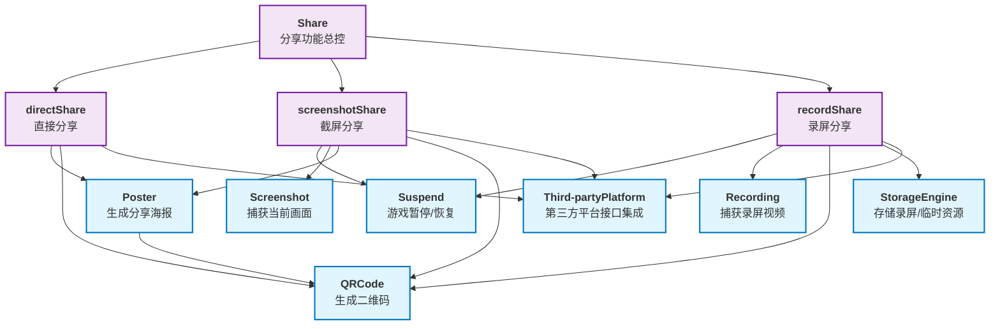

# Tech design for Share
## 挑战
* 提供丝滑的分享方式以满足用户的需求
    我们将尽可能的将Share与XBuilder的耦合度降低，让Share可以作为一块独立的功能，提供相应的分享方式，以及后续如果需要对分享方式进行修改的话，可以很方便的进行操作
## 模块
### sharePlatform
负责与外部平台的集成。目前支持：QQ、微信、抖音、小红书、B站。为directShare、screenshotShare 、recordShare提供第三方平台的接口支持
### Poster
生成分享海报，包含图片、二维码和项目信息
### DirectSharing
直接分享弹窗
### ScreenShotSharing
截屏分享弹窗
### ProjectRecordingSharing
录屏分享弹窗
### StorageEngine
负责本地或云端存储，用于保存录屏文件或临时资源

## 主要功能实现
这里我们描述如何通过组合上述模块来实现关键功能。
### Share
Share模块实现了share功能，借助直接directShare、screenshotShare 、recordShare三种分享模式实现分享
### directShare
直接分享模块，通过集成 Poster、QRCode 和 Third-partyPlatform，将生成的海报或二维码直接分享到第三方平台
### screenshotShare
截屏分享模块。通过runner暴露的API暂停游戏画面，并捕获当前场景，调用Poster生成分享内容，最后调用sharePlatform完成分享
### recordShare
录屏分享模块。通过runner暴露的API控制录制时机，并生成视频，同时结合 StorageEngine 存储以及生成链接，最终通过sharePlatform分享至目标平台
## 模块关系
下图说明了系统中各个模块之间的关系：

