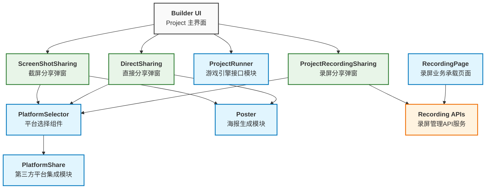

# Tech design for Share

## 挑战

- 提供丝滑的分享方式以满足用户的需求
- 我们将尽可能的将 Share 与 XBuilder 的耦合度降低，让 Share 可以作为一块独立的功能，提供相应的分享方式
- 以及后续如果需要对分享方式进行修改的话，可以很方便的进行操作
- 在移动端里的按键事件传化成真正的 Event 事件，而且降低与 Xbuiler 的耦合度

## 模块

### PlatformShare

负责与外部平台的集成。目前支持：QQ、微信、抖音、小红书、B 站。为三种分享方式提供第三方平台的接口支持

### PlatformSelector

定义可复用的平台选择组件，向各弹窗提供被选择的社交平台信息

### Poster

用于生成海报，包含图片、二维码和项目信息

### ProjectRunner

通过 ProjectRunner 获取 runner 游戏引擎上暴露的方法，控制游戏画面

### RecordingPage

录屏业务的承载页面

### Recording APIs

spx-backend 提供的用于对 Recording 管理的 APIs

## UI 层（分享弹窗）

### DirectSharing

项目页面上的直接分享弹窗，用于直接分享项目到各个平台，调用 Poster 模块以生成海报图片

### ScreenShotSharing

项目页面上的截屏分享弹窗，用于接收截屏图片（通过 ProjectRunner 模块）、调用 Poster 生成海报后分享到各个平台

### ProjectRecordingSharing

项目页面上的录屏分享弹窗，用于接收录屏后分享到各个平台，调用 Recording APIs 创建并存储对应的 Recording 记录

### RecordingItem

录屏条目显示组件，用于在各种列表环境中展示单个录屏记录（公共录屏列表、用户录屏列表等）。支持不同的显示模式，为用户自己的录屏提供编辑/删除操作。

See details in [`RecordingItem`](./module_RecordItem.ts).

### RecordingEdit

录屏元数据编辑弹窗，用于编辑录屏的标题和描述信息。提供表单验证功能，并与 Recording APIs 集成完成数据更新。

See details in [`RecordingEdit`](./module_RecordEdit.ts).

### RecordingStore

录屏状态的中心化管理存储，负责管理整个应用中的录屏状态。处理录屏计时、跨组件状态同步，并为 UI 反馈提供响应式状态更新。

See details in [`RecordingStore`](./module_RecordingStore.ts).

## 模块关系

下图说明了分享策略中各个模块之间的关系：

